 🚀 Organiza Infinity

**Dashboard de produtividade full stack desenvolvido para o Hackathon Infinity School 2025.**
---

## 📝 Descrição do Projeto

O **Organiza Infinity** é uma aplicação web full stack, concebida como uma solução completa para o Hackathon Infinity School 2025. O projeto visa otimizar a organização e a produtividade dos funcionários da escola, centralizando ferramentas essenciais e tarefas diárias em um dashboard unificado e intuitivo.

Com uma interface moderna e responsiva, alinhada à identidade visual da Infinity School, a plataforma oferece desde acesso rápido a links importantes, como planilhas e portais, até um sistema robusto de gerenciamento de tarefas pessoais através de um calendário interativo. A arquitetura foi pensada para ser segura e escalável, com um frontend dinâmico em React.js e um backend sólido em Python/Flask, garantindo uma experiência de usuário fluida e dados persistidos em um banco de dados PostgreSQL.

---

## ✨ Funcionalidades

* 🔐 **Autenticação de Usuário:** Sistema completo de Cadastro e Login com armazenamento seguro de senhas (hashing) e persistência de sessão.
* 📊 **Dashboard Centralizado:** Hub principal com acesso rápido a links internos (Planilhas) e externos (Portal do Aluno, Infinity App).
* 📅 **Calendário Interativo:** Permite a criação de eventos com data, hora e categoria. Os eventos são salvos no navegador para não serem perdidos.
* 👤 **Gerenciamento de Perfil:** Página de perfil que exibe os dados do usuário logado e permite a edição de informações (nome e bio).
* 📝 **Anotações Rápidas:** Um "bloco de notas" digital no estilo post-it, com salvamento automático no navegador.
* 🎨 **Tema Claro e Escuro:** Botão para alternar entre os temas, com a preferência do usuário salva para futuras visitas.
* 📱 **Design Responsivo:** Interface totalmente funcional e adaptada para diferentes dispositivos, com menus de navegação específicos para desktop (Sidebar) e mobile (BottomNav).
* 🔔 **Notificações e Lembretes:** Sistema de notificações no navegador para lembrar o usuário de suas tarefas agendadas no calendário.
* 🔒 **Rotas Protegidas:** Acesso às páginas internas (Dashboard, Perfil, etc.) restrito apenas a usuários autenticados.

---

## 🖥️ Telas do Projeto

| Funcionalidade | Visão Desktop 🖥️ | Visão Mobile 📱 |
| :--- | :---: | :---: |
| **Login (com Tema)** | 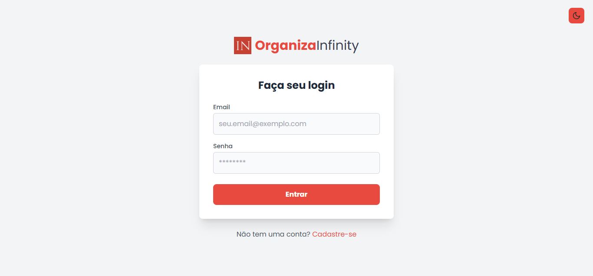 | 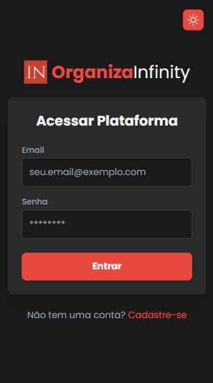 |
| **Cadastro (com Tema)** | 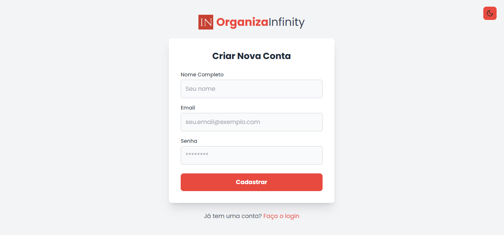 | 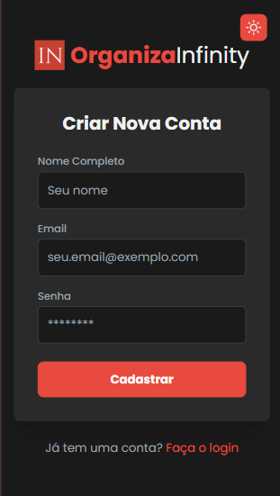 |
| **Dashboard** | 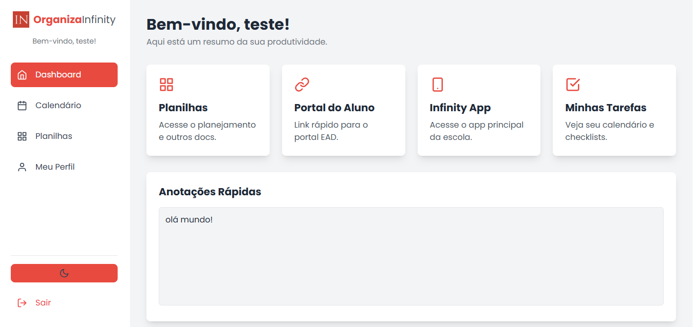 | 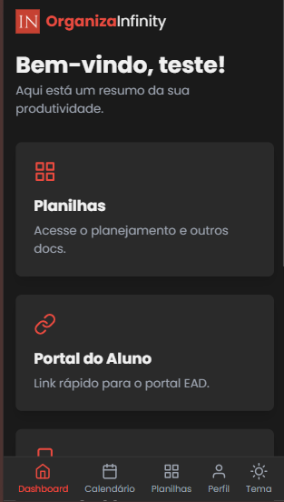 |
| **Calendário** | 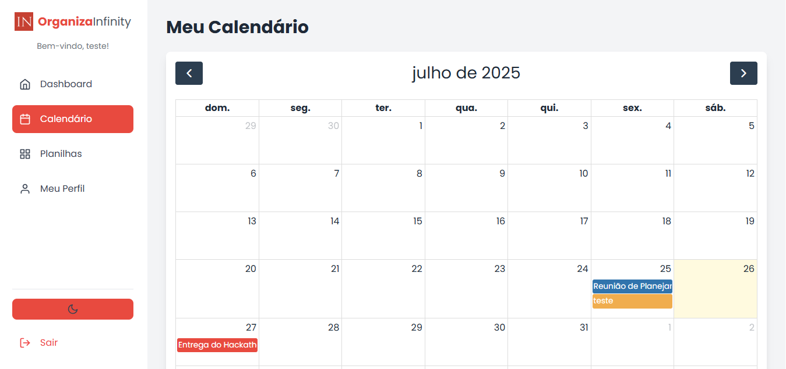 | 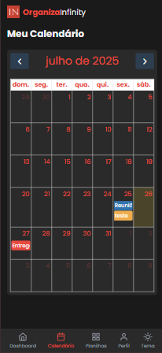 |
| **Perfil** | 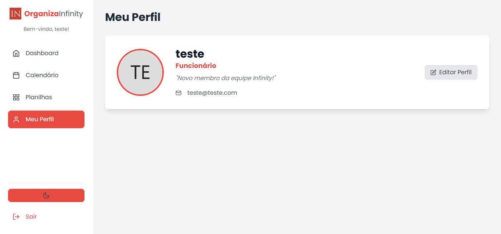 | 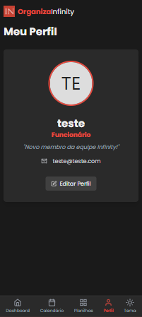 |
| **Planilhas** | 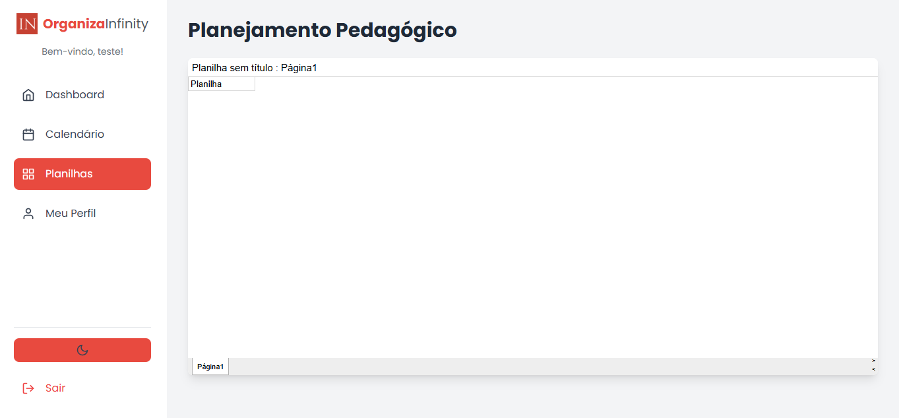 | 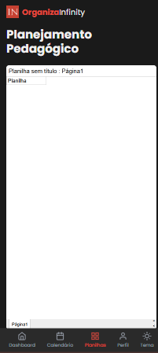 |

---

## 🛠️ Tecnologias e Decisões

Nossa stack foi escolhida para maximizar a produtividade e a robustez dentro do cronograma do hackathon, focando em ferramentas modernas e eficientes.

### Frontend

* **React.js (com Vite):** Escolhemos React por sua componentização e ecossistema maduro. O Vite foi a escolha para o ambiente de desenvolvimento pela sua velocidade absurda (Hot Module Replacement quase instantâneo), o que foi crucial para um desenvolvimento ágil.
* **Tailwind CSS:** Optamos pelo Tailwind por sua abordagem utility-first, que nos permitiu construir e prototipar interfaces complexas e responsivas diretamente no JSX, sem a necessidade de escrever CSS customizado. Isso acelerou drasticamente o desenvolvimento da UI.
* **React Router DOM:** É a solução padrão da indústria para roteamento em aplicações React, permitindo a criação de uma Single Page Application (SPA) fluida e com navegação interna sem recarregamento de página.
* **Context API:** Para o gerenciamento de estados globais como Tema (claro/escuro) e Autenticação, a Context API nativa do React foi a escolha perfeita por ser simples, eficaz e não adicionar a complexidade de bibliotecas externas como Redux para um projeto deste escopo.

### Backend

* **Python (com Flask):** Flask foi escolhido por ser um micro-framework, o que nos permitiu criar uma API REST de forma rápida e com pouca configuração. Sua simplicidade foi ideal para focar na lógica de negócio.
* **PostgreSQL:** Decidimos usar um banco de dados relacional robusto como o PostgreSQL (hospedado no Neon) em vez de soluções mais simples para demonstrar a capacidade de construir uma aplicação mais escalável e com práticas de banco de dados do mundo real.
* **Bcrypt:** A segurança foi uma prioridade. Escolhemos o `bcrypt` para o hashing de senhas, garantindo que as credenciais dos usuários sejam armazenadas no banco de dados da forma mais segura possível, seguindo as melhores práticas da indústria.
---

## 📂 Estrutura de Pastas (Frontend)

A estrutura de pastas do frontend foi organizada de forma modular para garantir a separação de responsabilidades e facilitar a manutenção.

- **`src/`**
  - **`assets/`**: Para ícones, logos e outras mídias estáticas.
  - **`components/`**: Para componentes reutilizáveis que são "peças de lego" da nossa UI.
    - **`auth/`**: Componentes específicos de autenticação (ex: `ProtectedRoute`).
    - **`layout/`**: Componentes de estrutura da página (ex: `Sidebar`, `BottomNav`).
  - **`contexts/`**: Onde ficam os gerenciadores de estado global (Tema e Autenticação).
  - **`pages/`**: Para componentes que representam uma página ou rota completa (ex: `DashboardPage`, `LoginPage`).
  - **`utils/`**: Para funções auxiliares e lógicas reaproveitáveis (ex: `notificationManager`).
  - **`App.jsx`**: O componente raiz que monta o app e define as rotas.
  - **`main.jsx`**: O ponto de entrada da aplicação, onde o React é renderizado no DOM.
---

## 📂 Estrutura de Pastas (Backend)

O backend foi estruturado para separar a lógica da API, as operações de banco de dados e as regras de negócio, seguindo as melhores práticas de aplicações Flask.

- **`backend/`**
  - **`venv/`**: Pasta do ambiente virtual do Python (ignorada pelo Git).
  - **`app.py`**: Arquivo principal da API Flask, onde todas as rotas são definidas.
  - **`db.py`**: Responsável unicamente pela lógica de conexão com o banco de dados PostgreSQL.
  - **`usuario.py`**: Contém a classe `Usuario` e todas as funções de negócio relacionadas a usuários (criar, buscar, atualizar, etc.).
  - **`requirements.txt`**: A lista de todas as dependências Python necessárias para rodar o projeto.
  - **`.env.example`**: O arquivo de exemplo que serve como guia para as variáveis de ambiente necessárias.
---

## ⚙️ Como Rodar o Projeto Localmente

Siga os passos abaixo para executar o projeto na sua máquina.

### ✅ Pré-requisitos

Antes de começar, garanta que você tenha os seguintes softwares instalados:

- [Node.js](https://nodejs.org/en/) (versão 18 ou superior)  
- [Python](https://www.python.org/) (versão 3.8 ou superior)  
- [Git](https://git-scm.com/)  

---

### 🚀 Passo a Passo

#### 1. Clonar o Repositório

```bash
# Clone este repositório para a sua máquina local
git clone https://github.com/rodrigopuma/hackaton_infinity.git
# Navegue para a pasta do projeto
cd hackaton_infinity
```
#### 2. Configurar e Rodar o Backend (API Flask)

```bash
Abra um terminal dentro da pasta do projeto.

# Acesse a pasta do backend
cd backend

# Crie o ambiente virtual
python -m venv venv

# Ative o ambiente virtual
# No Windows:
venv\Scripts\activate
# No Mac/Linux:
source venv/bin/activate

# Instale as dependências do backend
pip install -r requirements.txt

# Configure as variáveis de ambiente
copy .env.example .env

# Rode a API
flask run
✅ O servidor backend estará disponível em: http://localhost:5000

```
#### 3. Configurar e Rodar o Frontend (React)
```bash
Abra um novo terminal, também na pasta raiz do projeto.

# Acesse a pasta do frontend
cd frontend

# Instale as dependências do frontend
npm install

# Rode a aplicação
npm run dev
✅ A aplicação estará disponível em: http://localhost:5001
```
## 👨‍💻 Equipe -
 - Miguel Melo - Desenvolvedor Frontend & UI/UX - [@MiguelMelo](https://github.com/MikezinZ)

- Victor Vollney - Desenvolvedor Backend - [@VictorVollney](https://github.com/victorvollneydev)

- Luiz Rodrigo - Desenvolvedor Backend - [@RodrigoPuma](https://github.com/rodrigopuma)
